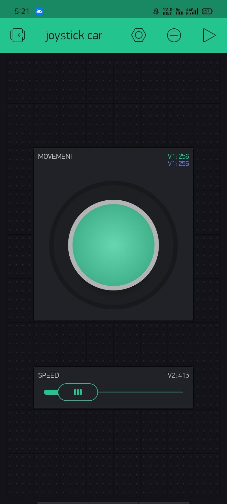

# Smart IoT Car 

Created a Remote Controlled WiFi smart car

## Hardware/Components used:
* NodeMcu / ESP8266
* L298N Motor Driver
* 3 Rechargeable 3.3v Batteries 
* Car Chasis
* 2 Motors
* Ultrasonic Sensor
* Connecting wires and a battery holder

## Software/Virtual tools used:
* Arduino IDE
* Blynk Application

# Working
The car is controlled through a virtual **Joystick** feature in Blynk app and the speed of the car is
controlled through a slider in the app.
The Ultrasonic Sensor is used to restrict the car from colliding to any obstacle infront of it.
The speed is manipulated by the Motor driver using `PWM (Pulse Width Modulation)` signals according to 
the value send to it through the slider in the blynk app.

## Joystick 
The joystick is based on the X-Y coordinates system. If you move the joystick in the X axis to a certain 
Y coordinate the car will move towards right direction and thus other direction work in this coordinate
based system.

## Ultrasonic Sensor
It is based on the ultrasonic wave send and receive time lap. The time between the send and receive of the 
wave with respect to the speed of sound in air will help in finding the distance between the obstacle and the car.
If the car is under a certain threshold distance from the obstacle the car will stop and go back for a time delay.

  

# Code
* You would need Blynk app authentication key to connect the Nodemcu to the app.
* Wifi SSID and PASSWORD is needed to which the nodemcu will get connected.
* Digital I/O pins is assigned to the motor driver pins and the ultrasonic sensor.
* functions are decaled to control the motors namely forward() ,backward() ,stop(), right() ,left().
* Virtual pins assigned to the joystick and slider.

Now the code then transferred to the Nodemcu and after the successful connection of wires.
The project works successfully!!!

