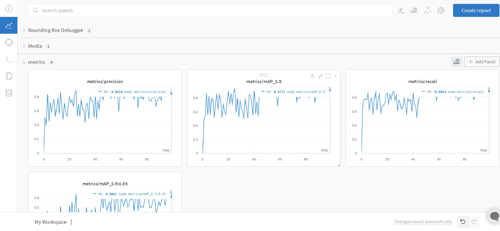
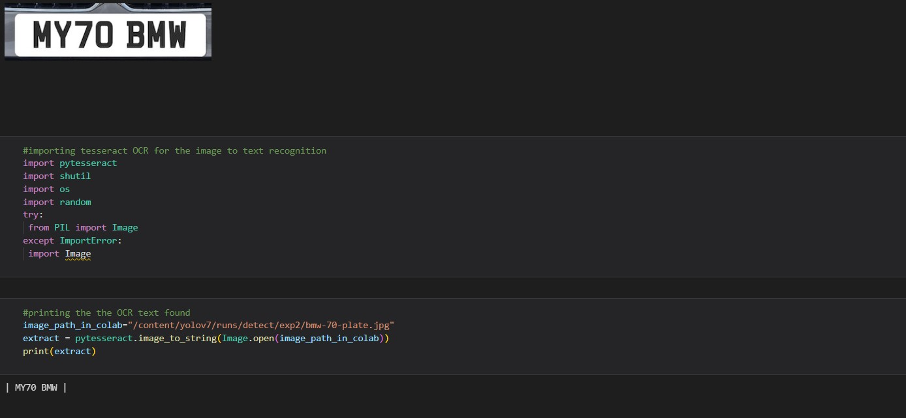

# Car Number Plate Detection and Extraction

* **Yolov7** single shot objecct detector is used.
* The dataset is used from **Roboflow** as it provide pre-defined annotated labelled image dataset 
  and also provide the api based dataset provision so not need to download such huge data on a local machine.
* The dataset contained 3.3k images.
* 100 epochs are used and a class is defined "license plate" .
* **Tesseract** is here is used for the `OCR (Optical Character Recognition)` part.
* used wandab.ai for the visualization of loss, precision, recall and mAP(mean Average Precision) during training.
* got mAP of 91.21% .

<p align="center">
  
</p>

## Detect.py
Here the offical github provides a detect.py to run your trained model on an image.
But we need to crop `RoI (Region of Interest)` part from the image to run the OCR on it.
For which I have provided the another file named as `detect-crop.py`.
In which I have wrote this part in line 110 of detect-crop.py for the cropping:
```
save_obj=True

                # Write results
                for *xyxy, conf, cls in reversed(det):
                    if save_obj:
                        if int(cls) ==0:
                            for k in range(len(det)):
                                x,y,w,h=int(xyxy[0]), int(xyxy[1]), int(xyxy[2] - xyxy[0]),   int(xyxy[3] - xyxy[1])
                                img_ = im0.astype(np.uint8)
                                crop_img=img_[y:y+ h, x:x + w]
                                ###!!rescale image !!!
                                im0=crop_img

```

## Output:
<p align="center">
  
</p>

## OCR
Then run this which will print the number retrieved from the number plate:
```
#importing tesseract OCR for the image to text recognition
import pytesseract
import shutil
import os
import random
from PIL import Image

#printing the the OCR text found
image_path_in_colab=<Enter the image path>
extract = pytesseract.image_to_string(Image.open(image_path_in_colab))
print(extract)

```
<p align="center">
  
</p>
